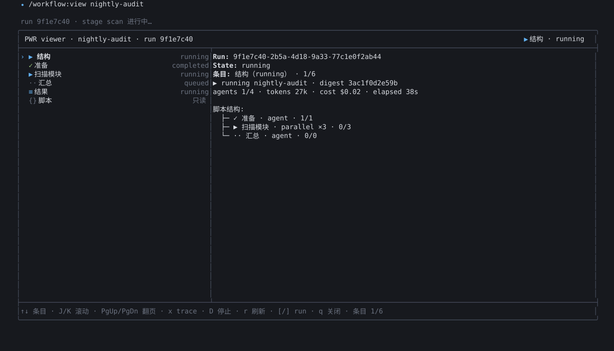
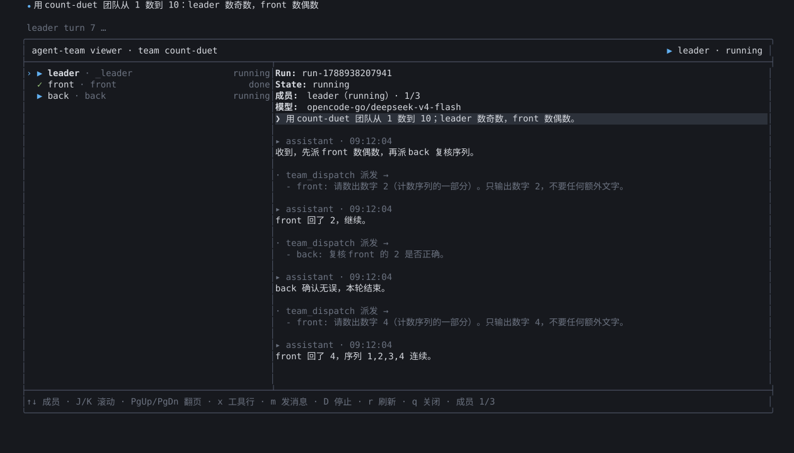
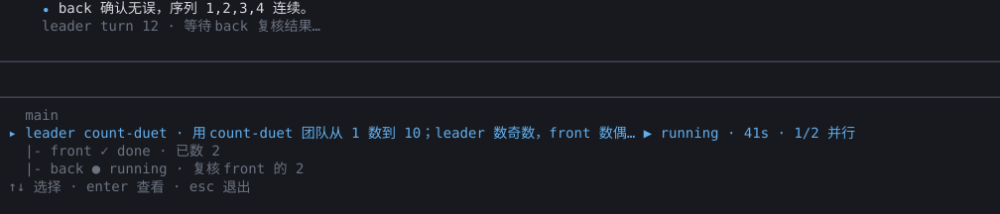

# Pi Coding Agent 扩展集

本目录是 Pi 编码助手的扩展工作区：一个主项目 **PWR**（本地工作流编排）加十一个独立卫星扩展（多 agent 团队、模型提供商、额度查询、流式计量、运行计时、定时任务、会话目标循环、本地代理桥、深度初始化、人工介入通知、免审批模式）；另有独立工具 **agent-manager**（带浏览器前端的 agent 管理工具，独立 Node 进程、非 Pi 扩展、agent 不感知，见 [agent-manager](#agent-manager--独立-agent-管理工具非扩展)）。全部为**零构建 TypeScript ESM**，由 Node ≥ 22.18 原生 type-stripping 直接执行，运行时无 npm 依赖。同屏状态条（footer 状态行与输入栏上下 widget）统一对齐秒节拍刷新、按固定顺序排列；各段文本已瘦身，**最靠前的可见段行首定格（无前导分隔符）**，其余段以 `│ ` 分隔（契约见 `docs/cross/status-bar.md`）。

| 扩展 | 作用 | 测试 |
| --- | --- | --- |
| [`pwr/`](#pwr--pi-workflow-runtime-主项目) | 工作流编排：脚本引擎 + 子进程 runner + 批准/保存/UI（solo 开启时批准卡按 once 自动批准；`/workflow:view` fleet 式分栏查看器；单一 `/workflow:*` 冒号命令面：裸 `/workflow` 生成/帮助 + 15 条子命令） | 439 个（node:test） |
| [`agent-team/`](#agent-team--多-agent-团队协作) | 可复用多 agent 团队：leader 调度成员协同完成任务（含全屏分栏会话记录查看器，支持查看器内停止 run、m 发消息直接对话；输入栏下方可选中亮块，展开为 main→leader→成员树，大团队自动窗口化；冒号命令面 `/team:list|:run|:status|:stop|:view|:clear|:doctor`；run 落终态自动把工作记录归档到主工作区 `history/team-runs/`） | 481 个 |
| [`stream-token-speed/`](#stream-token-speed) | 流式回复 TTFT / tokens/s 实时计量 | 45 个 |
| [`chatanywhere-provider/`](#chatanywhere-provider) | ChatAnywhere 双 provider（OpenAI 兼容 + Anthropic API），运行时自动发现模型 | 无 |
| [`provider-quota/`](#provider-quota) | provider 账户额度/余额查询 | 26 个（node:test） |
| [`run-timer/`](#run-timer) | 任务/回合/会话耗时计时 | 59 个（node:test） |
| [`loop/`](#loop) | /loop 定时任务：固定间隔 / 每天定时 / 每日窗口循环 + 一次性提醒 + --bg 后台 agent 模式（可选模型指定；管理走 `/loop:*` 冒号子命令） | 196 个（node:test） |
| [`goal/`](#goal) | 会话目标循环：`/goal` 设定条件，agent 跨回合自动推进直至评估器判定达成（清除非阻塞项走 `/goal:*` 冒号子命令） | 63 个 |
| [`deep-init/`](#deep-init) | 深度初始化：`/deep-init` 扫描仓库并生成层级 AGENTS.md 项目知识库 | 37 个（node:test） |
| [`opencode-bridge/`](#opencode-bridge--本地代理桥http-connect--socks5) | 随 Pi 启动拉起本地 HTTP CONNECT → SOCKS5 代理桥（独立 helper 进程，多实例复用；裸 `/opencode-bridge` 状态 + 冒号子命令 `/opencode-bridge:sync [port]`、`:restore`、`:status` 确认式修改 httpProxy 与备份恢复，均可撤销） | 114 个 |
| [`human-notify/`](#human-notify) | 人工介入 Windows Toast 通知：审批/输入/等人工具等待与 agent 结束时把人叫回终端；用户取消回合后不弹完成通知（Linux / macOS no-op） | 37 个 |
| [`solo-mode/`](#solo-mode) | `/solo` 免审批模式：审批摩擦门（PWR 批准卡 / bridge 确认 / deep-init 二次确认）自动按批准路径通过，仅当前会话（开关/状态走 `/solo:on|:off|:status`；`pi --solo` 启动即开启） | 22 个 |

## 安装

本仓库是一个标准 **pi 包**（根目录 `package.json` 带 `pi` manifest，keyword `pi-package`）。推荐通过 `pi install` 安装，由 pi 统一管理并支持升级；也可手动复制（开发调试用）。

要求：**Node.js ≥ 22.18**（原生 TS type-stripping，无构建步骤、无 bundler）。

### 方式一：pi install（推荐）

> **带 `@dev-laptop`**：默认分支 `master` 是历史发布线（v1.0.0，仅 5 个扩展）；活跃开发线是 `dev-laptop`（12 个扩展）。不带 ref 的安装会装到 master 旧包。

```bash
# 全局安装（写入 ~/.pi/agent/settings.json，跟踪 dev-laptop 分支）
pi install git:github.com/JHzzzzzZ/pi-agent-extensions@dev-laptop

# 或仅当前项目使用（写入项目 .pi/settings.json，项目信任后启动自动补装）
pi install -l git:github.com/JHzzzzzZ/pi-agent-extensions@dev-laptop

# 免安装试用（仅本次运行，装到临时目录）
pi -e git:github.com/JHzzzzzZ/pi-agent-extensions@dev-laptop
```

想用本机克隆的代码（开发中的未推送改动）时，用本地路径安装（不复制、不克隆）：

```bash
git clone -b dev-laptop git@github.com:JHzzzzzZ/pi-agent-extensions.git
pi install ./pi-agent-extensions
```

安装后由 pi 统一管理：

- **升级**：仓库 push 后执行 `pi update --extensions`（或 `pi update --all`）拉取最新即可——分支 ref 跟随分支头更新，tag/commit ref 则固定不动
- `pi list` 查看已装包；`pi config` 可单独启停包内的某个扩展
- 如需锁定版本，可带 tag 安装（如 `pi install git:...@v1.0.0`）；此时 `pi update` 只把克隆对齐到该 ref，不会自动跳新版本，升级需重新 `pi install git:...@新tag`

### 方式二：手动复制（开发调试）

将扩展目录复制到 `~/.pi/agent/extensions/`（全局）或可信项目 `.pi/extensions/`（项目级），然后在 Pi 中执行 `/reload` 生效。卸载 = 删除目录。每个扩展目录均以 `index.ts` 为入口（pi 自动发现约定：`extensions/*/index.ts`），整目录复制即可被自动加载。

```text
~/.pi/agent/extensions/pwr/
~/.pi/agent/extensions/stream-token-speed/
...
```

> 两种方式不要混用同一扩展，否则会重复加载（命令/状态条重复注册）。从手动复制切换到 `pi install` 时，先删除 `extensions/` 下的旧拷贝。

### 安装自检（可选）

不确定装上没有？在仓库根跑一次全新安装冒烟：把 `pi.extensions` 清单里的 12 个扩展复制到一个**全新的临时配置目录**，拉起真实 `pi --mode rpc` 进程，核对每个扩展的命令是否注册、启动期状态条/widget 是否写入。不碰你现有的 `~/.pi/agent/` 配置。

```bash
node tools/install-smoke.mjs        # ✓ = 12/12 扩展在干净目录下加载成功；✗ 时打印问题清单
node tools/install-smoke.mjs --task # 加跑一条真实模型任务：让模型调用全新安装的 loop_list 工具
node tools/install-smoke.mjs --install git:github.com/JHzzzzzZ/pi-agent-extensions@dev-laptop
                                    # 真跑一遍上面「方式一」的 pi install（联网）：核对装到的包版本/扩展清单/全部命令
```

`--install <源>` 是给“推荐安装路径”本身的自动自检：在全新临时配置目录里执行真实 `pi install <源>`（git 源或本地路径都行），随后定位装到的包、核对版本与扩展清单，再复用同一套命令面/TUI 键校验。上面那条 `@dev-laptop` 命令会直接告诉你远端当前发布线装出来是什么版本、几个扩展。可叠加 `--task`：先证明 `pi install` 装出来的包能用，再让模型在该安装形态下真调一次扩展工具。

`--task` 是“从零装到跑通”的端到端自检：在同一临时目录里带上你的 `auth.json`（仅临时目录内使用、结束即删，绝不打印内容），用真实模型跑一次工具调用，以事件流中的 `tool_execution_start/end` 为判据（模型自由文本不算数）。模型默认取你配置里的 `defaultProvider/defaultModel`，可用 `--model provider/id` 覆盖；普通安装冒烟不需要联网，`--task` 需要。

失败时临时安装目录会自动保留（便于排查），成功时自动清理。

## 5 分钟上手

从零到跑通第一个真实任务。每一步都有可验证的成功判据——看到判据再走下一步。

**Step 0 · 前置条件**（还没装 pi 的先做这步）

```bash
npm install -g --ignore-scripts @earendil-works/pi-coding-agent   # 安装 pi 本体
pi                                                                 # 首次启动按提示 /login 配置任意一个模型 provider
```

✅ 判据：`pi` 启动后能正常对话（发一句“你好”有回复）。

**Step 1 · 装本扩展包并验证**

```bash
pi install git:github.com/JHzzzzzZ/pi-agent-extensions@dev-laptop
pi                                                                 # 重新启动 pi
```

✅ 判据：在输入框敲 `/loop:list`，看到任务列表或“没有定时任务”提示——说明扩展已加载。若命令不存在，先在 pi 里执行 `/reload`，再用 `pi list` 确认包已登记。

**Step 2 · 第一个定时任务（loop）**

```text
/loop in 1m 说一句“安装成功，恭喜”
```

✅ 判据：约 1 分钟后 agent 主动向你道喜；输入 `/loop:delete <id>`（或 `/loop:clear`）清掉测试任务。

**Step 3 · 派第一个 agent 团队（agent-team）**

直接对 agent 说：“建一个两人团队 reviewer+writer，让 writer 写一首关于终端的短诗，reviewer 审完后汇报”。agent 会调 `team_create` 建团、`team_run` 派单；输入栏下方出现可选中亮块，`↓` 进入选中、`enter` 打开查看器看每个成员的完整会话记录。

✅ 判据：亮块显示 run 结束终态（`✓ · 耗时 · 费用`），报告自动送达会话。

**Step 4 · 跑第一个工作流（pwr）**

```text
/workflow 扫描当前仓库并生成一份架构概述
```

agent 生成脚本后弹出批准卡，选 `Run once`；`/workflow:view` 可实时观看每个子 agent 的执行轨迹。

✅ 判据：批准后运行完成，结果以 `pwr-workflow-result` 消息回传。

**排障 FAQ**

| 现象 | 处理 |
| --- | --- |
| `/loop` 等命令不存在 | pi 里执行 `/reload`；`pi list` 确认包已装；两种安装方式不要混用（重复加载会互相覆盖） |
| 模型不可用 / 无响应 | pi 里 `/login` 检查 provider 配置；`/model` 切换模型 |
| Windows Toast 不弹 | human-notify 仅 Windows 生效（Linux/macOS no-op）；`PI_HUMAN_NOTIFY=0` 会整体关闭 |
| 状态条没出现 stream-token-speed / provider-quota / run-timer | 这三个是状态 widget，需对应事件（流式回复 / 支持的 provider / 会话计时）才显示 |
| `/solo` 开了但审批卡还在弹 | 状态只对当前进程生效：`/reload`、`/new`、`/resume`、`/fork` 后自动复位；子 pi 进程（subagent / team 成员 / loop `--bg`）不继承 solo |

---

## pwr — Pi Workflow Runtime（主项目）

本地工作流编排扩展（v2.9.0）。用户编写受约束的 ECMAScript 工作流脚本（白名单 API：`meta/args/agent/pipeline/parallel/sleep/JSON`），PWR 校验后弹出批准卡，再由子 `pi` 进程作为 subagent 执行（solo 开启时批准卡按 once 自动批准）。



> 上图与下方 agent-team 截图出自同一条无头管线（`agent-team/tools/capture-screens.mjs`，真实 `TuiMainScreen` + 真实 `RunViewer` + 记录字节流的仿真屏）：左栏 roster（结构/各 stage/结果/脚本）右栏结构图与实时状态；场景数据为示例 run `nightly-audit`，可重复生成、可 diff。

### 效果示意

`/workflow:list` 运行列表（实测格式）：

```text
PWR runs (2)
run        script              status             elapsed    agents     tokens    cost     warnings
a1b2c3d4   code-review.js      completed          2m 14s     12/12      84.2k     $0.41    -
e5f6a7b8   doc-translate.js    running            0m 38s     3/9        21.7k     $0.09    [!] large run
```

`workflow_validate` 成功后自动弹出批准卡（关闭卡片仍是待批准，不是拒绝）：

```text
Approve workflow "code-review.js"?
run:   a1b2c3d4
digest 3f9a1c2e4b

（脚本执行计划：stage 划分 / 每个 stage 的 agent 数 / budget 估算）

Choices: Run once / Remember for this script / View raw script / Reject
  ❯ Run once
    Remember for this script
    View raw script
    Reject
```

`/workflow:view <runId>` 分栏运行查看器（左 roster + 右正文，v2.7.0）：

```text
╭──────────────────────────────────────────────────────────────────────────────────────────────────╮
│ PWR viewer · code-review.js · run a1b2c3d4                                      ▶ 结构 · running │
├────────────────────────────────────┬─────────────────────────────────────────────────────────────┤
│› ▶ 结构                     running│Run: a1b2c3d4-9e21-4c07-9f86-3d5a1b2c3d4e                    │
│  ✓ 审计                   completed│State: running                                               │
│  ▶ 修复                     running│条目: 结构（running） · 1/5                                  │
│  ≡ 结果                     running│▶ running code-review.js · digest 3f9a1c2e4b                 │
│  {} 脚本                       只读│agents 7/12 · tokens 84k · cost $0.41 · elapsed 1m 05s       │
│                                    │                                                             │
│                                    │脚本结构:                                                    │
│                                    │  ├─ ✓ 审计 · agent · 0/0 · 41s · 12k tok                    │
│                                    │  └─ ▶ 修复 · parallel ×8≈ · 7/8 · 1m 02s                    │
│                                    │                                                             │
├────────────────────────────────────┴─────────────────────────────────────────────────────────────┤
│↑↓ 条目 · J/K 滚动 · PgUp/PgDn 翻页 · x trace · D 停止 · r 刷新 · [/] run · q 关闭 · 条目 1/5     │
╰──────────────────────────────────────────────────────────────────────────────────────────────────╯
```

运行中每 750ms 刷新（仅 elapsed 走秒不重绘）；`D` 两步停止 run（Enter/Y 确认）。

### 功能

- **脚本引擎**（`engine/`）— acorn 解析 + 白名单校验（拒绝 `eval`/`vm`/反射/原型访问/动态代码）+ AST 解释器；单次快照安全边界，防宿主泄漏；脚本 ≤ 256KB、单运行 ≤ 1000 次 agent 调用、并发 ≤ 128
- **运行编排**（`runtime/` + `runner/`）— FIFO 调度、运行缓存（digest 命中直接回放）、child `pi` 进程适配器（结果 50KB / 摘要 8KB 截断、abort 时 SIGTERM → 5s 后 SIGKILL）；agent 定义发现（用户 > 项目 > 内置 scout/planner/reviewer/worker 兜底）；会话生命周期接线——/new、/resume、退出时自动中止在途运行（标记 cancelled），新会话自动复位可用
- **实时运行 trace**（v2.4.0）— 子 agent 的每一步（工具调用 + 参数摘要、长输出尾部、助手流式文本尾部约 1s 节流）实时显示在查看器对应 agent 行下方，tokens 随回合实时累计（单行截断、绝不透传原始工具输出）
- **完整结果送达** — 最终 JSON ≤ 8KB 时全量内联进完成消息；**> 8KB 时完整 JSON 落盘 `~/.pi/agent/workflows/results/<runId>.json`**，消息携带 JSON 安全截断的预览（含 `"__pwr_truncated__": true` 标记）+ `完整结果: <路径>` 行，消息总预算 16KB；持久化会话条目同样 JSON 安全截断并带 `resultPath` 字段，可从会话文件恢复全量结果
- **结果回传** — 运行成功或失败后以 `pwr-workflow-result` 消息自动唤起主 agent 汇报；用户主动取消不打扰
- **批准记忆** — 批准键 = 项目 canonical path + 脚本 SHA-256 digest；脚本被编辑后必须重新批准
- **保存/复用**（`workflow_save` + `/workflow:run <name> [参数]`）— 自动补齐 meta、落盘前强制重新校验、参数 JSON-schema 校验（`meta.argsSchema`）；args 支持 **`key=value` 语法**（按 schema 自动转类型，重复键/逗号成数组，`{` 开头仍按 JSON 解析，v2.4.0）；保存位置：用户范围 `~/.pi/agent/workflows/<name>.js`、项目范围 `.pi/workflows/<name>.js`（仅可信项目）
- **观察与控制**（`/workflow:*`）— 运行列表/详情/批准卡 UI，暂停/恢复/停止/重启，快捷键 `ctrl+alt+z/x/r`；`/workflow:saved` 列出已保存工作流（scope/描述/参数提示），`/workflow:delete` 不带名称时同样先列出（v2.4.0）

### 命令

| 命令 | 作用 |
| --- | --- |
| `/workflow <任务>` | 生成工作流（也支持 `workflow:` 前缀） |
| `/workflow:run <name> [args]` | 调用已保存的工作流（args 为 `key=value` 对或 JSON，如 `files=src depth=2`；运行时现读盘，无动态注册） |
| `/workflow:delete [name]` | 删除已保存的工作流（项目范围优先；不带名称先列出全部） |
| `/workflow:model [auto\|<model-id>]` | 查看/设置工作流默认模型（优先级：agent 定义 model > 脚本逐调用 model > PWR 默认 > 子 pi 默认） |
| `/workflow <任务>` | 生成工作流（也支持 `workflow:` 前缀）；空参或 `help` 显示完整分组帮助 |
| `/workflow:run <name> [args]` | 调用已保存的工作流（args 为 `key=value` 对或 JSON，如 `files=src depth=2`；运行时现读盘，无动态注册） |
| `/workflow:delete [name]` | 删除已保存的工作流（项目范围优先；不带名称先列出全部） |
| `/workflow:model [auto\|<model-id>]` | 查看/设置工作流默认模型（优先级：agent 定义 model > 脚本逐调用 model > PWR 默认 > 子 pi 默认） |
| `/workflow:save <runId>` · `/workflow:saved` | 把 run 保存为可复用命令 / 列出已保存工作流（scope/描述/参数提示） |
| `/workflow:list [status]` · `:view [runId]` · `:open <runId>` | 列表（可过滤）/ 全屏运行查看器 / 详情视图 |
| `/workflow:pause\|:resume\|:stop\|:restart <runId> [taskId]` | 暂停/恢复/停止（可单 agent）/重启单个 agent |
| `/workflow:script <runId>` · `:approve <runId>` · `:help` | 原始脚本 / 手动批准 / 帮助 |
| `workflow_save` / `workflow_validate` / `workflow_start` / `workflow_control` | agent 可调用的工具 |

### 测试与开发

```bash
cd pwr
npm install        # 仅 devDependencies（typescript、pi-* 类型、typebox）
npm test           # 439 个单测（test/ + tests/ + runtime/test/ + runner/test/）
npm run typecheck  # tsc --noEmit（strict + erasableSyntaxOnly，0 错误）
npm run demo       # 模拟 /workflow UI（无宿主）
```

测试全 mock（fake AgentRunner / fake child pi 进程），不产生真实子进程、无网络。架构与安全说明见 `pwr/DELIVERY.md`，DSL 语法与使用示例见 `pwr/README.md`。

### 安全边界

- 脚本无 FS/shell/network/process 直连；校验白名单执行，fail-closed
- 错误信息为静态模板，不泄露文件内容/密钥/脚本源码
- 会话 entry 只持久化运行元数据（不写脚本源码、args 原文、凭证）；`pwr-tmp://` 只在进程内展开
- 项目范围保存/加载受信任门控；runner 不可用返回 `AGENT_RUNNER_UNAVAILABLE`，绝不隐式回退主 agent

---

## agent-team — 多 Agent 团队协作

可复用、可对话创建的多 agent 团队（参考 Multica 的 squad/leader/dispatch 模式）。团队 = 1 个 leader + N 个成员，每个成员可指定独立后端模型（`provider/model`）与专属 system prompt。派单后由**独立 leader 子进程**自主拆解任务、通过 `team_dispatch` 工具并行调度成员子进程、审查结果并汇总报告交回主会话。





> 上两图由 `agent-team/tools/capture-screens.mjs` **无头重放真实渲染路径**生成（真实 `TuiMainScreen` + 真实 `TranscriptViewer`，终端只换成记录字节流的仿真屏），可重复生成、可 diff：场景数据为示例 run、助手正文按纯文本渲染（未接宿主 Markdown 主题），其余布局/边框/页签/状态色均来自组件本身。亮块的文字来自真实 `buildWidgetView`/`renderWidgetView`（即运行时经 `setWidget` 推送的同一份 string[]），屏上包装照抄宿主 `setExtensionWidget` 对 string[] 的代码路径（`Container` + `Text(line, 1, 0)`），空编辑器是 `↓` 激活门控的真实状态。同一工具同时生成上方 pwr 查看器截图。

效果示意（运行期间亮块，实测格式）：

```text
默认（折叠单行，↓/← 或 alt+↓ 展开）：
agent-team dev-team · ↓/← 查看详情

展开态（main→leader（含任务摘要）→成员树，↑↓/j/k 移动，enter 进查看器；末行恒为成员行；run 落定亮块自动消失）：
main
leader dev-team · 重构登录模块并补齐单测 ▶ running · 3m12s · 2/3 并行
  ├─ frontend ● running · 正在改 login.tsx
  ╰─ backend ✓ done
↑↓ 选择 · enter 查看 · esc 退出
```

- **对话式建团** — 主 agent 调 `team_create`/`team_list` 工具直接创建/查看团队；团队定义文件（`~/.pi/agent/teams/*.md` 或项目 `.pi/teams/*.md`）可随时手改，下一次派单即生效
- **派单与复用** — `/team:run <团队> <任务>`（统一派单入口）、`team_run` 工具（默认后台，返回含 runId；报告或失败摘要完成后自动送达主会话——failed 状态/错误/成员结果/部分报告同通道必达，主 agent 可重试或如实转告用户）；同一团队反复使用；`/team:stop` 或 `team_stop` 工具按 runId 中止（settle-aware：停止后拿到 aborted 终态记录，报告 followUp 不再送达，可立即重新派单）；团队名可与子命令同名（保留词概念已退役）
- **隔离与统计** — 成员可选 `worktree: true` 独立 git worktree（分支 `team/<runId>/<member>`，不自动合并）；按成员统计 token/费用；运行记录持久化为会话 entry
- **进度可视（可选中亮块）** — 数据驱动：有活跃 run 才挂亮块，run 落定自动消失（不再常驻终态行）。默认只有一行折叠提示（`agent-team <团队> · ↓/← 查看详情`），`↓`/`←`（焦点在主编辑器且编辑器为空时）或 `alt+↓` 展开为 `main → leader（含任务摘要）→ 成员…` 树（末行恒为成员行：`↓`/`j` 到底即最后一个成员；成员行连接符 `├─`（非末项）/ `╰─`（末项圆角）、带状态图标与最新活动尾注，多行文本先压平成单行；每行按宿主内容宽补齐并包背景，选中行用更强背景），再按 `↑`/`↓`/`j`/`k` 移动，第 0 行再按 `↑`/`k` 收回折叠；`enter` 在 `main` 行只收起选中、在 leader/成员行直接打开查看器并定位该 actor、`esc`/其它键退出并放行编辑器；`/login`、`/model` 等选择器/对话框打开时焦点不在编辑器，widget 完全不介入（方向键原样让给选择器，选中态自动退出）；状态变化（leader 事件/派发起止）即时刷新，1s tick 仅兜底。`/team:clear` 用于丢弃排队的 viewer 对话消息（无内容时提示亮块随 run 结束自动隐藏）。TUI 行为对照 pi-subagents fleet 代码级同步（见 [agent-team/docs/tui-sync.md](agent-team/docs/tui-sync.md））
- **防失控与崩溃恢复** — 派发预算可配（frontmatter `budget:` 块：dispatch/成员运行次数 + 可选费用/token 硬上限，超限自动中止 `BUDGET_EXCEEDED`）；派单前 model 预检（引用不存在的模型直接拒绝，不启动任何子进程）；每 run 元数据快照落盘，主会话中断后下次启动自动 reconcile 残留 run 并诊断孤儿 leader（只报告不杀）；`/team:doctor` 自检报告
- **会话记录查看器** - `/team:view` 全屏左右分栏(fleet inspector 同款:左栏成员 roster 带选中标记与状态,右栏 Run/State/成员/模型/活动 五行元信息头 + 选中成员的连续会话流--任务气泡 + 主 agent 同款 Markdown 回复 + 合并工具行;活动行为选中 actor 当前活动（思考中 / 工具调用 <tool> / 排队中 / 已完成/失败/已中止 / run 已结束）+ 5 秒分桶的 `距上次输出` 时长（分桶文本计入刷新指纹，时钟重绘至多每桶一次、终态零时钟重绘）；≈85% 终端高,窄于 36 列仅提示),run artifacts 落盘、run 结束后仍可查;`D` 停止整个 run（两步确认，确认后中止 leader 与全体成员、报告不再送达，与 `team_stop` 同语义）、`r`/`R` 手动刷新、`q`/`Esc`/`ctrl+c` 关闭；按键（v1.8.0）全面对齐 fleet：`↑↓/j/k` 切成员、`Shift+J/K` 滚正文、`Home/End` 首末成员、`PgUp/PgDn` 翻页、`x/X/ctrl+o` 工具行，仅 `m` 发消息是特有键；主 agent 可用 `team_transcript` 工具转述记录要点
- **查看器内直接对话（`m` 发消息）** — 选中成员/leader 后按 `m` 进入单行输入（右栏输入行），`Enter` 提交；**目标 = leader 且 run 运行中 → RPC steer 插话**（v1.15.0：leader 子进程以 `--mode rpc` 拉起，消息在当前回合边界送达、不打断任务，回复出现在本 run 的 transcript 里）；其余情况（成员目标 / run 已落定 / 通道不可用）走派单语义：消息编成新 run 的 task（附目标 actor transcript 尾部作上文），run 运行中则排队、落定后自动链式派出（failed/aborted 清空）；报告照常 followUp 送达

```bash
cd agent-team
npm install && npm test        # 481 个测试（含真实 git worktree 用例）
node tools/capture-screens.mjs # 重新生成 docs/assets/{agent-team-viewer,pwr-viewer,agent-team-widget}.svg（无头真实渲染）
npm run typecheck
```

详见 [`agent-team/README.md`](agent-team/README.md)（团队文件格式与示例见 `agent-team/examples/dev-team.example.md`）。

---

## stream-token-speed

流式回复速度计量：显示 **TTFT（首 token 延迟）** 与瞬时 **tokens/s**（1s 滑动窗口 + EMA 平滑，250ms 节流），结束后保留本轮 TTFT / 平均速度（汇总以 `~` 标注平均值）。计量范围覆盖 text / thinking / tool call 增量；tool result 与工具执行进度一律排除。不读取、不记录、不发送任何消息内容。段前缀由 `status-band` 统一决定：最前段无前缀、其余段 `│ `（跨插件契约见 `docs/cross/status-bar.md`）。

效果示意（终端状态行，实测格式；单段时即最前段）：

```text
TTFT 412ms · 86.4 tok/s    ← 流式回复期间实时刷新（热身期速度显示 —；未出首 token 时只显示 TTFT —）
TTFT 412ms · ~78.6 tok/s   ← 回合结束后保留 TTFT + 平均速度（~ 标注平均）
TTFT — │ tok72% mcp40%(14:30) │ pwr 2▶ 1✓   ← 多段同屏：最前段定格，其余以 │ 相连
```

```bash
cd stream-token-speed
node --experimental-strip-types --test test/*.test.ts   # 43 个测试
node e2e/run-e2e.mjs                                    # 真实 pi 进程端到端自测
```

## chatanywhere-provider

通过 [ChatAnywhere](https://docs.chatanywhere.tech) 的 OpenAI 兼容 API 与 Anthropic Messages API 接入模型（`chatanywhere` + `chatanywhere-claude` 两个 provider）。**模型运行时自动发现**：加载时探测 `GET {base}/models`，按“家族线 + 档位”归并去重注册——同种（同线同档）取最新（thinking 变体优先）、每条线最多保留 3 个档位、标准渠道优先于 `-ca`；**非 chat 模型（embedding/tts/whisper/生图等）一律不注册**，**旧代系列（GPT-4.x/o3/gemini-2.x 等）整代删除、每家族只保留最新代**（v1.2.0）。命中内置定价目录（catalog.ts：GPT-5.6/5.x、DeepSeek、Qwen、Kimi、GLM、MiniMax、Gemini、Claude 等，CA币/1K 换算为 Pi 成本跟踪）取目录价，目录外新模型自动注册为“未定价”（默认规格 + 接口窗口值）。探测失败 fail-closed：两个 provider 均不注册模型，绝不回退静态目录。

```bash
# 设置 API Key（两种方式任选；探测自动按 环境变量 → ~/.pi/agent/auth.json 顺序读取）
export CHATANYWHERE_API_KEY=sk-xxx            # 方式一：环境变量
# ~/.pi/agent/auth.json 里加 {"chatanywhere": {"type": "api", "key": "sk-xxx"}}   # 方式二：auth.json
export CHATANYWHERE_BASE_URL=https://api.chatanywhere.tech/v1   # 可选，Claude 端点自动去 /v1
```

## provider-quota

查询当前 provider 的账户额度/余额并在终端状态行显示（无 provider 前缀；段前缀由 `status-band` 决定：最前段无前缀、其余段 `│ `）。内置 OpenRouter、DeepSeek、ChatAnywhere、智谱 GLM、OpenCode Go 适配器；智谱原始 token 仅允许发往 HTTPS 白名单主机。智谱状态行输出 `tokX% mcpY%(HH:mm)`（跨日 `(MM-dd HH:mm)`，只看绝对刷新时间，字段以实测 `nextResetTime` 为准）。OpenCode Go（订阅制，key 即 `auth.json` 里 `opencode-go` 条目）输出 `X%/Y%/Z%(HH:mm)`（5 小时/周/月三窗口，缺失窗口跳过），后缀重置时间跟随命中的限额窗口（达到限额显示该窗口重置时间，都未限额默认显示 5h 窗口）。每 5 分钟自动刷新（10s 超时 + 3 次重试退避），切换模型时立即刷新；手动刷新 `/quota`。API Key 从环境变量或 `~/.pi/agent/auth.json` 读取。

效果示意（终端状态行，实测格式；单段时即最前段）：

```text
$4.58 (used $5.42)      ← OpenRouter：剩余额度（已用）
102.50 CNY              ← DeepSeek：余额
186.40                  ← ChatAnywhere：余额
tok72% mcp40%(14:30)    ← 智谱：token/MCP 窗口占用 + 下次刷新时间
15%/6%/3%(03:41)        ← OpenCode Go：5h/周/月窗口 + 命中限额窗口的重置时间
```

```bash
node --experimental-strip-types --test provider-quota/index.test.ts
```

## run-timer

终端底部状态行计时：当前任务耗时、本轮对话耗时、会话总耗时（按对齐墙钟秒边界刷新，与其他状态条不抢相位）。含 CJK 视觉宽度处理，避免中文导致布局错位。

效果示意（widget，实测格式）：

```text
任务 05:32 · 本轮 00:41 · 本会话 18:07
上次任务 12:03（已结束） · 本轮 00:00 · 本会话 18:07   ← 任务结束后切换为「上次任务」
```

```bash
node --experimental-strip-types --test run-timer/run-timer.test.ts run-timer/aligned-ticker.test.ts
```

## loop

定时任务扩展（精简版，参考 Claude Code `/loop`）：固定间隔循环 + 每天定时循环 + 每日时间窗口循环 + 一次性提醒 + 后台 agent 模式。到期任务经 `deliverAs: "followUp"` 在回合间送达——agent 空闲则开新 turn，正在响应则排队到当前 turn 结束；错过的时间点不补跑。任务以全量快照持久化为会话条目（`loop-tasks-v1`，不进 LLM 上下文），随会话恢复；重复任务 7 天过期、每会话上限 50 个、widget 显示下次倒计时（按对齐秒节拍刷新，文本无变化时跳过重绘）。

| 命令 | 作用 |
| --- | --- |
| `/loop 5m <任务>` | 固定间隔循环（单位 `s/m/h/d`，最小 1m，秒向上取整；兼容 `every 2 hours` 分写） |
| `/loop in 30m <任务>` | 一次性提醒（相对时间） |
| `/loop at 15:00 <任务>` | 一次性提醒（本地时刻，已过则排到明天） |
| `/loop daily at 09:00 <任务>` | 每天固定时刻循环（`every day at` 等价；首触发已过则排明天）（v1.2.0） |
| `/loop every 1h from 00:00 to 09:00 <任务>` | 每日时间窗口 `[start, end]` **闭区间**内按间隔循环：网格锚定在窗口起点（如每小时 → 0:00, 1:00, …, 9:00），支持任意间隔（`every 90m`），要求 `start < end`，跨天用本地时区日 rollover（v1.2.0） |
| `/loop --bg <上述任意创建形态>` | **后台模式**（v1.3.0）：到期不注入当前会话，而是拉起独立子 pi 进程（`pi --mode json -p --name loop-<id>`，无 `--no-session`），每次触发开新会话落盘；会话 id 自动记入任务，用 `pi --session <id>` 可随时恢复后台对话记录。上一轮未跑完则本次跳过；会话关闭自动终止在途子进程并标记 interrupted |
| `/loop --bg --model <provider/id> <创建形态>` | **后台模型指定**（v1.4.0）：透传子 pi 进程的 `--model` 参数（接受 pi 的模型 pattern/ID 语法），不传用 pi 默认模型；仅后台模式支持，前台注入无法指定。适用场景：定时巡检用便宜模型、重要任务用强模型 |
| `/loop:list` | 查看全部任务（后台任务附 `[后台]` 徽标与最近一次运行状态/会话 id） |
| `/loop:pause <id>` / `:resume <id>` | 暂停/恢复（id 支持前缀匹配） |
| `/loop:delete <id>` / `:clear` | 删除单个/全部任务 |

效果示意（widget + `/loop:list`，实测格式）：

```text
widget：⏰ loop 2 个任务 · 下次 04:32 · 后台运行 1

/loop:list：
a1b2c3d4  every 30m                          14:30:00  检查 CI 状态
e5f6g7h8  [后台] every 1h from 00:00 to 09:00  01:00:00  夜间巡检部署
```

daily/window 调度与固定间隔共用同一套语义：错过的时间点不补跑（跨天/跨窗口只触发一次），暂停后恢复、会话恢复（hydrate）时错过的触发点直接重算到下一个未来时刻；旧格式快照（无 schedule 字段）零迁移兼容。

**后台模式细节**（v1.3.0，`runner.ts`；v1.4.0 起支持模型指定）：子进程 cwd 取宿主会话目录，会话落在该项目的 sessions 目录（`pi -r` 选择器可见，`--name loop-<id>` 可辨识）；JSON 输出首行会话头 `{"type":"session","id":…}` 被捕获记入 `lastRun`；单次运行超时 30 分钟（SIGTERM→SIGKILL）；完成后通知结果摘要与恢复提示。模型经 `--model` 透传（`/loop:list` 的调度列以 `@provider/id` 标注），未知模型由子 pi 报错、任务标记 failed。前台模式行为完全不变。

**agent 工具**（v1.1.0，v1.2.0 起支持新调度语法，v1.3.0 起支持 `mode: "foreground" | "background"`，v1.4.0 起 `loop_create` 支持可选 `model` 参数——仅 `mode="background"` 生效，前台带 model 返回类型化错误）：模型可直接调用 `loop_create`（`task` + `schedule` 调度描述，语法同命令）、`loop_list`、`loop_delete` 管理定时任务——"每 30 分钟检查一次 X"、"每天早上 9 点做 X"、"每天 0 点到 9 点每小时巡检"、"后台每小时用便宜模型帮我检查一次部署"这类自然语言请求由 agent 自行建任务。

```bash
cd loop
npm install        # 仅 devDependencies（typescript、pi-coding-agent 类型、typebox）
npm test           # 196 个测试（node:test）
npm run typecheck  # tsc --noEmit（strict，0 错误）
```

## goal

会话目标循环（参考 Claude Code `/goal`）：`/goal <条件>` 设置完成条件后，agent 跨回合自动推进——每个回合结束（`agent_settled`）由**独立 LLM 评估器**（当前会话模型的一次小调用，限 512 tokens）根据目标 + 最近回合 assistant 输出判定 `{met, reason}`；未达成则携带评估原因自动开启下一回合（`triggerTurn + followUp` 续跑通道），达成后自动清除目标并写入结果条目。**不设轮次上限**，可在条件文本中自限（如 "or stop after 20 turns"）。

- `/goal` 查看状态（目标/已评估轮数/时长/评估器最近判定）；`/goal:clear|:stop|:off|:reset|:none|:cancel` 停止（共享同一动作）；`/goal:resume` 在手动中断或评估器连续失败暂停后恢复；`/goal:status` 为状态副本
- 每会话一个活跃目标，条件最长 4000 字符；恢复会话时目标保留但轮数/计时重置；不改变任何工具权限语义
- 状态行「已运行」时长在目标活动/暂停期间每秒刷新（对齐秒节拍，与计时/循环状态条同帧）
- 手动中断（Esc）自动暂停；评估器连续 3 次失败暂停（瞬时失败不杀循环）

效果示意（终端状态行，实测格式；单段时即最前段）：

```text
◎ 让 pwr 全部测试通过且 typecheck 零错误 · 3轮 · 1m05s      ← 推进中（目标截到 20 显示列）
⏸ 让 pwr 全部测试通过且 typecheck 零错误 · 已暂停 · 1m05s  ← 手动中断后自动暂停
◎ 修复全部测试 · 4轮 · 1m05s │ tok72% mcp40%(14:30) │ pwr 2▶ 1✓  ← 多段同屏（最前段定格）
```

```bash
node --experimental-strip-types --test goal/index.test.ts goal/aligned-ticker.test.ts   # 63 个测试
```

---

## deep-init

深度初始化（参考 oh-my-openagent `init-deep`）：`/deep-init` 扫描仓库结构并生成层级 `AGENTS.md` 项目知识库——根文件（项目全貌）+ 按复杂度评分选出的子目录文件，agent 自动读取相关上下文，无需手工维护。提示词驱动薄封装：插件只做参数解析、已有文件预检与 `--create-new` 二次确认，四阶段中发现阶段按规模并行派 subagent 探索并汇总，其余由主 agent 用自身工具执行。

- `/deep-init` 增量更新（默认）；`/deep-init --create-new` 全量重建（已有文件时须加 `--yes` 确认）；`--max-depth=N` 限深（默认 3）；末尾可跟目标目录
- 评分选址：文件数 3x>20、引用中心度 3x>20；>15 建、8–15 有独立领域才建、<8 跳过，根必建
- 写铁律：已存在用 `edit`、不存在用 `write`；子不复父、电报体；完成照发 `=== init-deep Complete ===` 报告

```bash
cd deep-init && npm install && npm test   # 32 个测试；另有 npm run typecheck
```

---

## opencode-bridge — 本地代理桥（HTTP CONNECT → SOCKS5）

背景：opencode-go 的 Muse Spark 等模型按出口 IP 限区，而 Pi 只支持 HTTP 代理（不认 `socks5://`）。本扩展随 Pi 启动确保一个**独立 helper 进程**在跑：它监听 `127.0.0.1:<端口>`（默认 `10899`），把 HTTP CONNECT 转成你本地 v2rayN 的 SOCKS5（默认 `127.0.0.1:10808`）。需要让模型请求走本桥时，运行 `/opencode-bridge:sync`：**人工确认后**才修改 settings.json 的 `httpProxy` 字段（仅此字段，其余配置不动；修改前原文件自动备份到 `settings.json.bak-opencode-bridge-<时间戳>`）。扩展自身**绝不自动修改** settings.json（solo 审批门开启时确认自动按批准路径）。端口优先级：命令行参数 > `PI_BRIDGE_PORT` > 配置文件（settings.json 同目录 `opencode-bridge.json`，仅 `{"bridgePort": N}`）> 默认值。

- **进程隔离** — 桥运行在独立进程（`opencode-bridge-helper.mjs`，零依赖 .mjs）中，任何 socket 异常/未捕获异常都不会影响 Pi 主进程；Pi 侧 spawn 后 `unref()`，不持有子进程资源
- **多实例复用** — `session_start` 只做 TCP 探测：桥已在监听则直接复用（多个 Pi / subagent 共用一个桥），仅在必要时拉起 helper；端口被另一个桥占用时新 helper 以 0 退出（竞争安全）
- **协议健壮性** — CONNECT 完成 SOCKS5 无认证握手（域名方式，分片应答按缓冲累积解析）后双向转发（含请求头部剩余数据）；普通 HTTP 返回 405；上游拒绝/握手失败返回 502；客户端中途断开只清理自身，桥继续服务后续请求
- **受控退出** — SIGTERM/SIGINT 优雅退出；`GET /__bridge/shutdown`（仅本地可达）供测试/受控关闭
- **端口自定义** — `/opencode-bridge:sync [port]` 直接跟端口，或无参时交互式询问（回车保持当前）；改端口后一次确认覆盖写配置文件、停旧桥、起新桥、改 httpProxy 四件事；停旧桥时校验自家 helper 指纹（不符则不动并提示手动释放），等端口释放超时则 abort，全程 fail-closed

前置条件：本地 SOCKS5 代理（如 v2rayN）已在 `PI_BRIDGE_SOCKS_HOST:PI_BRIDGE_SOCKS_PORT` 运行。

| 命令/配置 | 作用 |
| --- | --- |
| `/opencode-bridge` | 查看状态（必要时尝试启动）：监听地址、上游 SOCKS5、端口来源、配置引导；冒号子命令：`:status`（同裸命令）/ `:sync` / `:restore` |
| `/opencode-bridge:sync [port]` | 修改 settings.json 的 `httpProxy` 指向本桥（人工确认 + 自动备份；仅改 `httpProxy` 字段；桥不通且现值指向本桥时提议移除）；带参用参数端口，无参交互询问并持久化到 `opencode-bridge.json`，改端口自动迁移（指纹确认停旧桥 + 起新桥 + httpProxy 联动） |
| `/opencode-bridge:restore` | 从备份列表选择恢复 settings.json（人工确认；恢复前先把当前配置再备份一份，保证恢复操作本身可撤销） |
| `PI_BRIDGE_PORT` | 桥监听端口，默认 `10899`（仅绑定 127.0.0.1；需 1-65535 整数，非法启动时报静态错误） |
| `PI_BRIDGE_SOCKS_HOST` | 上游 SOCKS5 主机，默认 `127.0.0.1` |
| `PI_BRIDGE_SOCKS_PORT` | 上游 SOCKS5 端口，默认 `10808` |
| `PI_BRIDGE_LOG` | helper 日志文件路径（默认与 helper 同目录的 `opencode-bridge.log`；单行/文件大小均有上限，不记录 payload） |

```bash
cd opencode-bridge
npm install        # 仅 devDependencies（typescript、pi-coding-agent 类型）
npm test           # 114 个测试（node:test；helper 集成测试用真实子进程 + 手写 fake SOCKS5 server）
npm run typecheck  # tsc --noEmit（strict，0 错误）
```

---

## human-notify

人工介入通知：需要你回到终端时发送一条 Windows Toast——等审批/输入时（`ui_prompt_start`，标题“Pi 等待你确认”）、等人工具启动时（`tool_execution_start` 且工具名在 `WAITING_TOOL_NAMES` 名单，首批只有 `plan_mode_question`；宿主内置审批/提问不走 `ui_prompt_start`，只能按工具名特判）与 agent 完全结束时（`agent_settled`，标题“Pi 任务完成”）。正文按触发类型差异化：均带一句话摘要（审批/结束取最新 assistant 尾部文本，等人工具优先取 args 中的问题文本）；标题不变。用户按 Esc / Ctrl+C 中断回合后，其后的 `agent_settled` 不再发完成 Toast（人都走了不喊人回来看；照抄 goal 的取消标记模式，审批/等人工具 Toast 不受影响）。只在 Windows 生效，Linux / macOS 直接 no-op（后续支持）。

- **零依赖原生通道** — 内联 WinRT PowerShell（ToastNotificationManager + XmlDocument），`child_process.spawn` detached + unref 派生，不阻塞会话、不持有会话资源；发送失败静默吞掉，绝不破坏会话
- **文案安全** — 差异化文案：审批/输入→“收到确认请求，请回到终端处理：<assistant 尾部摘要>”；等人工具→args 中用户可读的问题文本（取不到回退 assistant 尾部，再取不到回退静态模板）；结束→“本轮结论：<assistant 尾部摘要>”。摘要先截到 80 码点、正文整体再截到 120 码点并压单行，不透传工具原始输出与密钥；全局 5s 防抖避免审批 + settle 连发刷屏
- **一键关闭** — `PI_HUMAN_NOTIFY=0` 关闭全部通知

```bash
node --experimental-strip-types --test human-notify/index.test.ts   # 37 个测试
```

---

## solo-mode

免审批模式：`/solo` 一键切换后，本仓库的**审批摩擦类**门自动走批准路径——PWR 批准卡按 once 自动批准（绝不写 remembered 记录）、opencode-bridge 的 sync / 端口切换 / restore 确认自动通过（restore 自动选最新备份）、deep-init 的 `--create-new` 二次确认自动放行。**误触保护类确认不受影响**（agent-team viewer `D` 停止、`/team:clear`、`/workflow:delete` 选择仍人工）。

- **仅当前会话** — 状态写在本进程独占文件 `${PI_SOLO_MODE_FILE:-~/.pi/agent/solo-mode.json}`（`{pid, activatedAt}`，读者校验 `pid === process.pid`）；`/reload`、`/new`、`/resume`、`/fork` 与退出即复位，子 pi 进程（PWR sub-agent / agent-team 成员 / loop `--bg`）天然不继承
- **开启需确认** — `/solo` 开启时弹一次确认（列出受影响的门）；无 UI 环境拒绝激活（fail-closed）；状态条显示 `⚡ solo`（最前段无前缀，多段时为 `… │ ⚡ solo`）
- **`pi --solo` 启动即开启** — 经宿主原生 CLI flag 通道（`pi.registerFlag`/`getFlag`）读取，显式意图跳过确认、无 UI 也能生效（无头 `-p` / `--mode json` 可用）；`/solo:off` 在会话内生效，`/reload` 等新会话按启动 flag 重新启用
- **命令** — `/solo` 切换、`/solo:on|:off|:status`（旧空格写法只提示改名）、未知参数提示用法
- **跨扩展契约** — 状态文件与 fail-closed 口径见 `docs/cross/solo-approval-gate.md`（pwr / opencode-bridge / deep-init 各一份同构 `solo-gate.ts` 只读实现）

```bash
node --experimental-strip-types --test solo-mode/index.test.ts   # 22 个测试
```

---

## todo-cli

`todos/` 工作流的**仓库级 CLI 工具**（非 Pi 插件、无 pi 依赖）：登记 / 领取 / 完成 / 盘点 / 交接扫描从「agent 手写 grep + edit」升级为有测试锁定的原子操作。唯一入口是仓库根的 `node tools/todo.mjs`（实现源 `todo-cli/core.ts`），`REPO_ROOT` 由脚本位置解析，任意 cwd 可用。

```bash
node tools/todo.mjs summary [--json]                    # 全量盘点（open / processing / done）
node tools/todo.mjs list [--status open|processing|done] [--file <name>]   # 按状态/文件列条目
node tools/todo.mjs add --file <name> "描述"             # 追加登记（跨文件查重，重复拒绝；--force 强制）
node tools/todo.mjs claim --file <name> --match "子串" [--branch feat/x]   # 领取并标 processing
node tools/todo.mjs complete --file <name> --match "子串" [--note "说明"]  # 完成勾选 [x] 并去标注
node tools/todo.mjs lint                                # 单向核对 pi.extensions 扩展 ↔ todo 文件
node tools/todo.mjs triage [--json]                     # 只读扫描 worktree↔条目关联与遗留
node tools/todo.mjs --help                              # 打印用法
```

- **边界** — 只读写仓库 `todos/` 下文件（路径穿越拒绝）、保持 CRLF 行尾、绝不自动 commit；登记（`add`）不标 processing，领取（`claim`）才标（动作显式分离）
- **测试** — 仓库根 `npm run test:todo`（16 个，含 3 个进程边界 E2E）；卡片见 [`docs/tools/todo-cli.md`](docs/tools/todo-cli.md)

---

## agent-manager — 独立 agent 管理工具（非扩展）

把 `~/.pi/agent/sessions/` 里落盘的 Pi 会话（v3 JSONL）和本机 pi agent 进程放进一个浏览器页面管理。**独立于 Pi 运行**：一个 Node HTTP 进程 + 浏览器页面，pi 未运行也能启动与浏览；agent 不感知它（不注册任何 Pi 扩展点、不 import 宿主 SDK、根 `pi.extensions` 不含此项）。

- **启动** — 从仓库根 `node agent-manager/server.ts`（默认端口 8787，自动开浏览器），或 `cd agent-manager && npm start -- --port 9000 --sessions <dir> --pi <path> --no-open`。要求 Node ≥ 22.18（原生 type-stripping 直接运行 `.ts`）。
- **能力（会话）** — 列出 / 检索（用户+助手文本与会话名，大小写不敏感）/ 预览；重命名 = 向会话文件末尾追加宿主语义的 `session_info`（不改文件名/header）；删除 = 移入工具回收站（可恢复）。重命名/删除/恢复都是**两段式**：先 dry-run 返回计划，页面确认后带 `confirm:true` 执行。
- **能力（Agents）** — 以 `pi --mode json -p` 启动子进程（新建 / `--session` 接续 / `--fork` 分支），实时查看状态、pid、最后输出与逐行输出（列表 2s / 详情 1s 轮询，页面隐藏时暂停）；停止按钮二次确认后杀**整个进程树**（win32 `taskkill /T /F`，posix 进程组）。
- **设置** — 改 sessionDir / piPath / port 并持久化（`<home>/.pi/agent/agent-manager/config.json`）；优先级 CLI flag > 环境变量 > 配置文件 > 默认值。`--pi` 推荐指向 `cli.js`：Node 直启，绕开 Windows 上 `.cmd` 必须经 `cmd.exe` 包装的引号问题。
- **边界** — 仅监听 `127.0.0.1`（页面无鉴权，**勿做端口转发/反向代理**）；不做外部终端 pi 进程发现（只管理本工具启动的 agent）；不给运行中 agent 发消息（接续 = 停止后在会话页用 `pi --session <id>` 或本工具「接续」启动）；install-smoke 只覆盖 `pi.extensions` 的 12 个扩展，本工具不在其中。

```bash
cd agent-manager && npm install && npm test   # 37 个测试（14 core + 10 runner + 13 server）
npm run typecheck                              # tsc -p tsconfig.json --noEmit
npm run test:e2e                               # opt-in 真机 e2e（4 个；需 AGENT_MANAGER_E2E_MODEL + 鉴权 + 网络）
```

---

## 开发约定

- **测试框架**：`node:test` + `node:assert/strict`，无 vitest/jest、无 mock 库（手写进程边界 fake）
- **代码风格**：`pwr/` 用 tab 缩进，`agent-team/`、`run-timer/`、`stream-token-speed/`、`loop/`、`goal/`、`opencode-bridge/`、`solo-mode/`、`todo-cli/`、`agent-manager/` 用 2 空格；相对导入必须带 `.ts` 扩展名；类型导入用 `import type`（`verbatimModuleSyntax`）；错误用结果联合（`{ ok: true, value } | { ok: false, code, message }`），不用异常
- **注入约定**：时钟注入（`now` 参数）、依赖注入（deps 对象），保证测试确定性
- 无 linter、无 formatter、无构建步骤；`pwr/vendor/acorn.mjs` 为生成文件，勿修改
